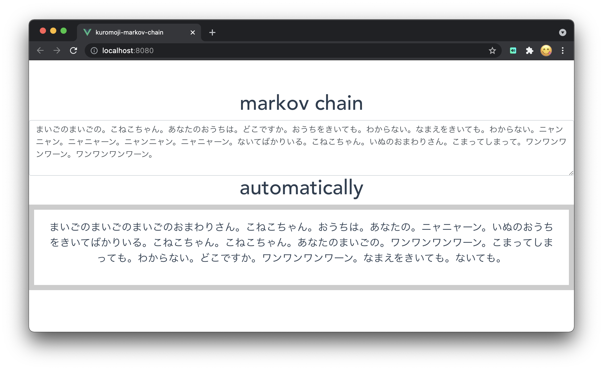

<h1 align="center">
   
  
   
  markov chain
   
</h1>
<h4 align="center">
   In this sample, we are using Kuromoji.js to perform markov chain.
   This sample is running on top of vue.js.
   It analyzes Japanese input in the text area in real time.
   The original text is created by a Markov chain algorithm.
   
   
</h4>

# live demo
https://tatsunori-iwaki.github.io/kuromoji-markov-chain/

# screen shots

